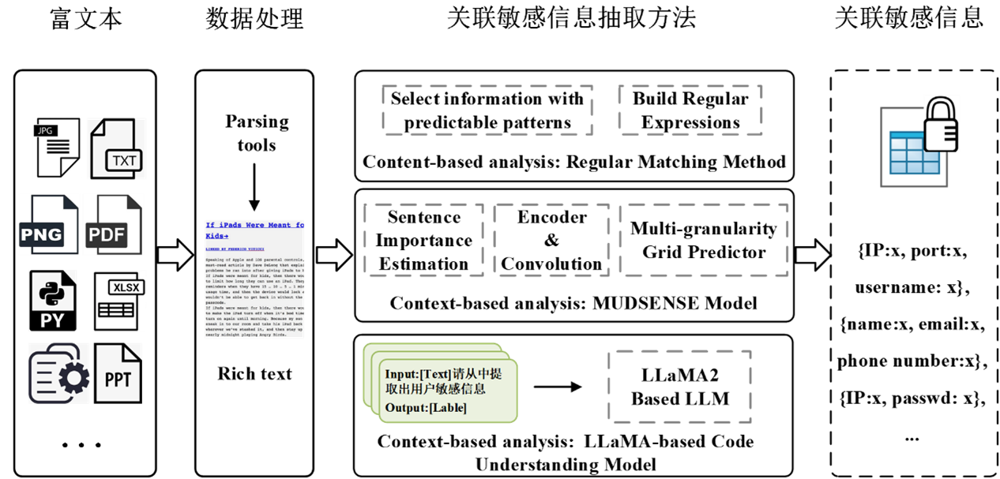

 # MUDSENSE：基于上下文关联特征的自适应敏感信息抽取系统

 第二届中国研究生网络安全创新大赛 一等奖作品

我们利用开源解析工具处理富文本数据，处理过的数据通过敏感信息抽取模块识别并抽取敏感信息。我们提出的富文本关联敏感信息抽取系统主要由三部分组成，基于上下文的多粒度抽取模型MUDSENSE、基于上下文以LLaMA为基座的代码理解大模型以及基于内容的规则匹配方法。




## 1. 模型环境依赖

```
- python (3.8.12)
- cuda (11.4)
- numpy (1.21.4)
- torch (1.10.0)
- gensim (4.1.2)
- transformers (4.13.0)
- pandas (1.3.4)
- scikit-learn (1.0.1)
- prettytable (2.4.0)
```

## 2. 数据下载
可以在[data](https://huggingface.co/datasets/AndrewKing/rich_data_detection_dataset)中下载数据，其中
- data_original：赛方给的数据样例及格式
- sense: 使用LLMs级联生成的富文本敏感信息数据

我们同样提供了部分数据的处理代码 `./MUDSENSE/data/sense/data_process.py`.

## 3. 数据准备

- 下载数据
- 将其处理成和 `data/`相同格式的数据
- 将处理过的数据放在 `data/`目录下

## 4. Checkpoint下载

-  [Lllama2-7B](https://huggingface.co/meta-llama/Llama-2-7b): 用于代码理解，抽取代码中的敏感信息
- [MUDSENSE checkpoint](https://huggingface.co/AndrewKing/rich_data_detection)：识别语义丰富文本中的非规则敏感信息，并进行敏感信息关联

## 5. 敏感信息抽取 

我们的代码中包含了三个部分的代码：

- 基于上下文的多粒度抽取模型MUDSENSE (`MUDSENSE/`文件夹中): 用于识别语义丰富的文本中蕴含的非规则敏感信息。
- 基于上下文学习的代码理解大模型（`LLM_code/`文件夹中）：选择Llama2-7B为基座模型，通过人工对部分含有敏感信息代码段进行标注，在提示的末尾加上待提取代码文本，让语言模型确定输入分布、输出分布、输入输出映射以及格式。
- 基于内容的规则匹配：首先预定义规则敏感信息正则表达式，利用正则表达式准确、有效地抽取基于内容的敏感信息，如IP地址、电子邮件、API密钥、私钥和证书。

## 6. 训练MUDSENSE模型
- 1. 首先下载BERT、RoBERTa等文本编码器，并将其保存在`./MUDSENSE/model/`中
- 2. 下载2中sense数据，并保存在`./MUDSENSE/data/sense/`中
- 3. 训练MUDSENSE模型
```python
  python ./MUDSENSE/MUDSENSE/main.py
```
